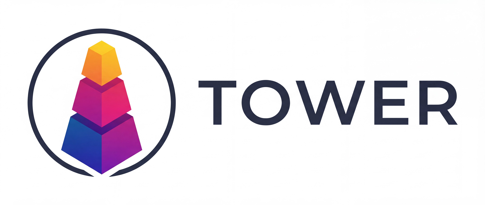

# Tower-GPT

一个非常简单的gpt实现 
模型使用pytorch实现，不依赖transformers框架 
分词器使用sentencepiece 
包含了详细的中文注释，适合初学者学习使用

## 配置需求

torch2.0或更高 
sentencepiece库 
galore-torch库 
transformers库(仅用于加载 Adafactor 优化器)

推荐使用python3.11 

## 代码

### 主目录

包含了模型、训练、运行的代码

### tokenizer

包含了使用sentencepiece构建的分词器 

### utils

开发时使用的工具文件

### img

LOGO 图标

## 使用

[train](https://github.com/midway2333/tower_gpt/blob/main/train.py)文件用于训练 

[generation](https://github.com/midway2333/tower_gpt/blob/main/generation.py)文件用于推理文本 

## 已知问题

 

  <b>已修复</b> 

- 线性层与词向量权重共享不可用，代码以注释形式保留 
- <a href="https://github.com/midway2333/tower_gpt/blob/main/decoder/tfer_dataloader.py">tfer_dataloader</a>可能导致在同一个epoch中重复利用近似文本，部分训练文本无法利用的问题 
- mask无法识别padding并处理 
-<a href="https://github.com/midway2333/tower_gpt/blob/main/decoder/train.py">train</a>与<a href="https://github.com/midway2333/tower_gpt/blob/main/decoder/talk_train.py">talk_train</a>缺失梯度清除 
- 断点续训会在开始时出现loss增加的情况 
- <a href="https://github.com/midway2333/tower_gpt/blob/main/decoder/dataset.py">dataset</a>在加载器下无法遍历完整数据的问题 

 

  <b>尚存在</b> 

- 此版本所有问题均已修复(`・ω・´) 

## 更新

 

  <b>8.31更新</b> 

- 上传了<a href="https://github.com/midway2333/tower_gpt/blob/main/decoder/train.py">training</a>文件，新文件修复了<a href="https://github.com/midway2333/tower_gpt/blob/main/decoder/tfer_dataloader.py">tfer_dataloader</a>中的问题，同时为训练中添加了梯度裁剪，提高了代码在大数据量下的训练效率 

 

  <b>9.28更新</b> 

- 上传了<a href="https://github.com/midway2333/tower_gpt/blob/main/decoder/talk_train.py">talk_training</a>文件，新文件可以进行对话训练 
- 为<a href="https://github.com/midway2333/tower_gpt/blob/main/decoder/train.py">training</a>添加了梯度累计与混合精度，<a href="https://github.com/midway2333/tower_gpt/blob/main/decoder/talk_train.py">talk_training</a>同样具有这些新特性 
- 删除了过时训练文件 

 

  <b>10.2更新</b> 

- 对<a href="https://github.com/midway2333/tower_gpt/blob/main/decoder/model.py">模型文件</a>部分更改/优化 
- 修复线性层与词向量权重共享不可用的问题 
- 完善padding处理机制 
- 更换激活函数 
- 上传了新的工具文件 

 

  <b>11.24更新</b> 

- 上传了更新的<a href="https://github.com/midway2333/tower_gpt/blob/main/decoder/train.py">training</a>文件，此文件为实验性长文本训练文件 
- 优点是可以直接使用json训练，可以记录训练日志 
- 缺点是dataset对ram需求更大，dataset效率更低 

 

  <b>12.1更新</b> 

- 完善了<a href="https://github.com/midway2333/tower_gpt/blob/main/decoder/train.py">training</a>，现在此文件可以完成断点续训，并保存训练日志 
- 新的tokenizer 
- 删除了部分已不需要工具文件 
- 增加了新的工具文件 

 

  <b>12.15更新</b> 

- 对部分文件的重命名 
- 为<a href="https://github.com/midway2333/tower_gpt/blob/main/decoder/train.py">train</a>添加了测试集支持 
- 修复了<a href="https://github.com/midway2333/tower_gpt/blob/main/decoder/train.py">train</a>与<a href="https://github.com/midway2333/tower_gpt/blob/main/decoder/talk_train.py">talk_train</a>缺失梯度清除的问题 
- <del>我个若知居然4个月没发现这个问题</del>  
- 对<a href="https://github.com/midway2333/tower_gpt/blob/main/decoder/train.py">train</a>与<a href="https://github.com/midway2333/tower_gpt/blob/main/decoder/talk_train.py">talk_train</a>的代码优化

 

  <b>12.28更新</b> 

- 拆分<a href="https://github.com/midway2333/tower_gpt/blob/main/decoder/train.py">train</a>为<a href="https://github.com/midway2333/tower_gpt/blob/main/decoder/train.py">train</a>与<a href="https://github.com/midway2333/tower_gpt/blob/main/decoder/dataset.py">dataset</a>，使代码结构更清晰 
- 添加了使用生成器的<a href="https://github.com/midway2333/tower_gpt/blob/main/decoder/generator_train.py">generator_train</a>，适用于大数据集的训练，防止内存泄漏 
- 为<a href="https://github.com/midway2333/tower_gpt/blob/main/decoder/train.py">train</a>添加了微调支持 
- 优化了<a href="https://github.com/midway2333/tower_gpt/blob/main/decoder/train.py">train</a>的log与断点续训 
- 代码注释优化 

 

  <b>25.1.5更新</b> 

- 为<a href="https://github.com/midway2333/tower_gpt/blob/main/decoder/train.py">train</a>与<a href="https://github.com/midway2333/tower_gpt/blob/main/decoder/generator_train.py">generator_train</a>添加优化器续存支持(修复断点续训会在开始时出现loss增加的情况) 
- 修改<a href="https://github.com/midway2333/tower_gpt/blob/main/decoder/model.py">模型文件</a>的Post layer normalization为Pre layer normalization 
- 修改了模型预设参数 
- 代码注释优化 

 

  <b>25.3.2更新</b> 

- 重构<a href="https://github.com/midway2333/tower_gpt/blob/main/decoder/train.py">train</a>与<a href="https://github.com/midway2333/tower_gpt/blob/main/decoder/talk_train.py">talk_train</a>代码文件，增加了一些新功能 
- 修复<a href="https://github.com/midway2333/tower_gpt/blob/main/decoder/dataset.py">dataset</a>在加载器下无法遍历完整数据的问题 
- <a href="https://github.com/midway2333/tower_gpt/blob/main/decoder/dataset.py">dataset</a>添加对</a>与<a href="https://github.com/midway2333/tower_gpt/blob/main/decoder/talk_train.py">talk_train</a>的数据加载支持 
- 新添<a href="https://github.com/midway2333/tower_gpt/blob/main/decoder/dpo_train.py">dpo_train</a>与<a href="https://github.com/midway2333/tower_gpt/blob/main/decoder/dpo_dataset.py">dpo_dataset</a>，旨在支持dpo训练 
- 工具文件结构优化 

 

  <b>25.9.6更新</b> 

- 剔除了一些不必要的线性偏置 
- 修复训练文件的进度条预测时间显示问题 
- <del>我就说项目还会更新的吧.jpg</del>  

 

  <b>25.9.13更新</b> 

- 重构多头，提高并行效率 
- 修改位置编码为内嵌式RoPE 
- 为模型添加 init 方法 

 

  <b>25.9.26更新</b> 

- 添加 padding 掩码 
- 修复<a href="https://github.com/midway2333/tower_gpt/blob/main/decoder/dataset.py">dataset</a>错误 
- 完善续训练

 

  <b>25.12.21重大更新</b> 

- 完全重构训练、推理、dataset/dataloader文件 
- 新的 tokenizer 
- 新的工具文件结构 
- 若干遗留问题修复

## TODO

- DPO 训练代码
- train grad-checkpoint 支持
- train BLUE 评估支持

## 有关问题

本项目虽然已经经过了一段时间的发展，但规范性与实用性依然无法看齐业界内的其它项目；如果您发现了任何新的问题或有关本项目的优化，欢迎在本项目的[issues](https://github.com/midway2333/tower_gpt/issues)中提出 
[第二代Tower](https://github.com/midway2333/Tower2)已经开源！但本项目依然维持更新

